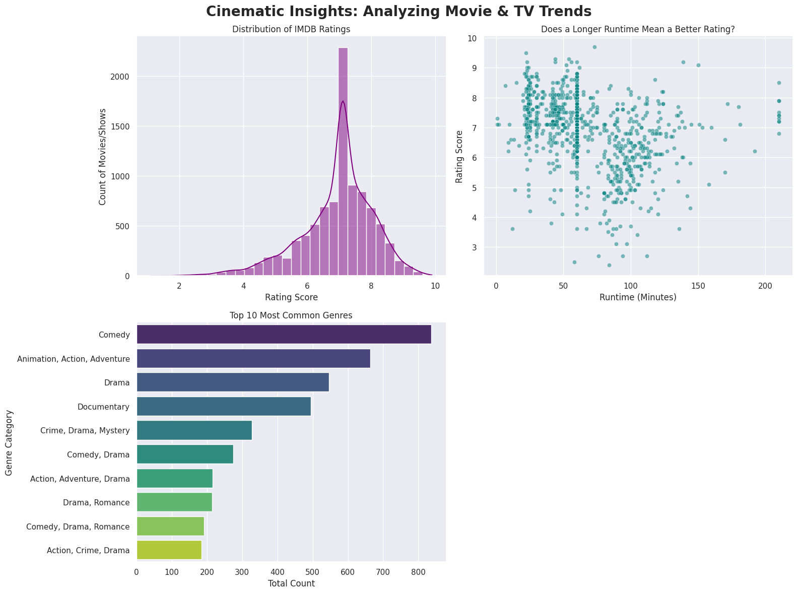

# Data-Cleaning-Visualization-Project
# Cinematic Insights: Movie & TV Trend Analysis
*A Data Cleaning and Visualization Project*

## The Objective
This project processes a raw, unstructured dataset of nearly 10,000 movies and TV shows to uncover trends in runtime, genres, and audience ratings. 

## Key Preprocessing Steps
* **Duplicate Handling:** Removed 431 identical records.
* **Missing Data Imputation:** Handled over 1,800 missing IMDB ratings using median imputation to preserve data integrity.
* **Outlier Capping:** Standardized runtime data by capping extreme outliers (e.g., 14-hour entries) to a maximum of 3.5 hours.

## The Visual Report

## Strategic Insights (C.I.R.)
* **Context:** The dashboard above analyzes content trends across the entertainment industry.
* **Insight:** The rating distribution chart reveals that the vast majority of content sits solidly between a 6.0 and 7.5. Furthermore, the scatter plot indicates that exceptionally long runtimes (over 150 minutes) do not guarantee a higher rating.
* **Recommendation:** For future production investments, studios should prioritize script quality over extended runtimes, as padding a movie's length does not positively correlate with higher audience satisfaction.
